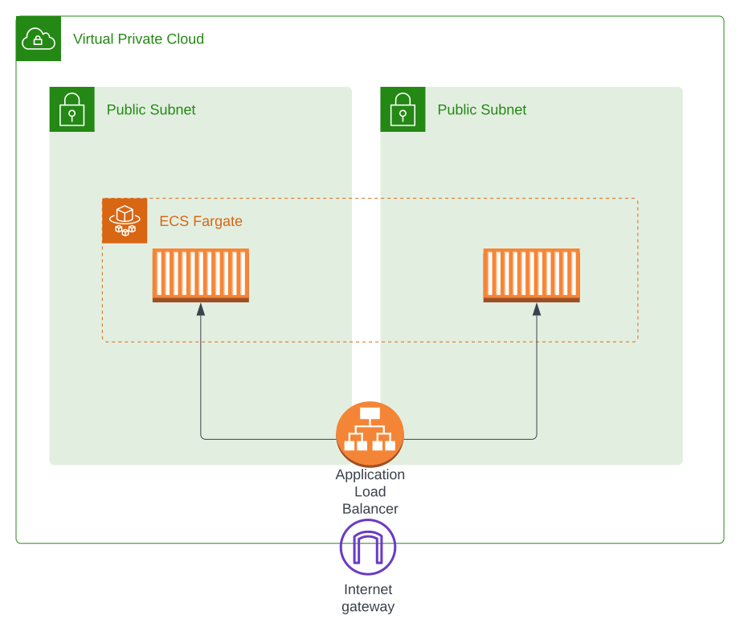

# Running containerized webapp on AWS Fargate

## Resource Overview

This folder holds the Terraform code to deploy a simple web application running on AWS.
The following resources will be created upon deployment:
- AWS VPC including 2 public subnets and an internet gateway
- Application Load Balancer
- AWS ECS Cluster including a Task defintion and a Service
- IAM resources

## Prerequisites

Before running terraform to deploy resources, the following is required:
- local installation of Terraform (check the version constraints in the Terraform configuration block)
- AWS account and IAM user with appropriate permissions

## Quick Start

In order to deploy the application to your AWS account follow these steps.
1. `git clone` this repo to your computer.
2. change the current working directory to *terraform/environment/staging*
3. Run `terraform init`
4. Run `terraform apply`
5. the application will be available at the provided URL presented as output upon completion

## Input parameters

| name          | description           | default value |
|---------------|-----------------------|---------------|
| cidr | The IPv4 CIDR block for the VPC | -             |
| container_image | Container Image for the web application | nginxdemos/hello |
| container_port | Port on which the container receives traffic | 80 |
| stage | Stage of the current deployment, i.e. prod, dev, test | dev |
| desired_count | Number of tasks to run | 2 |